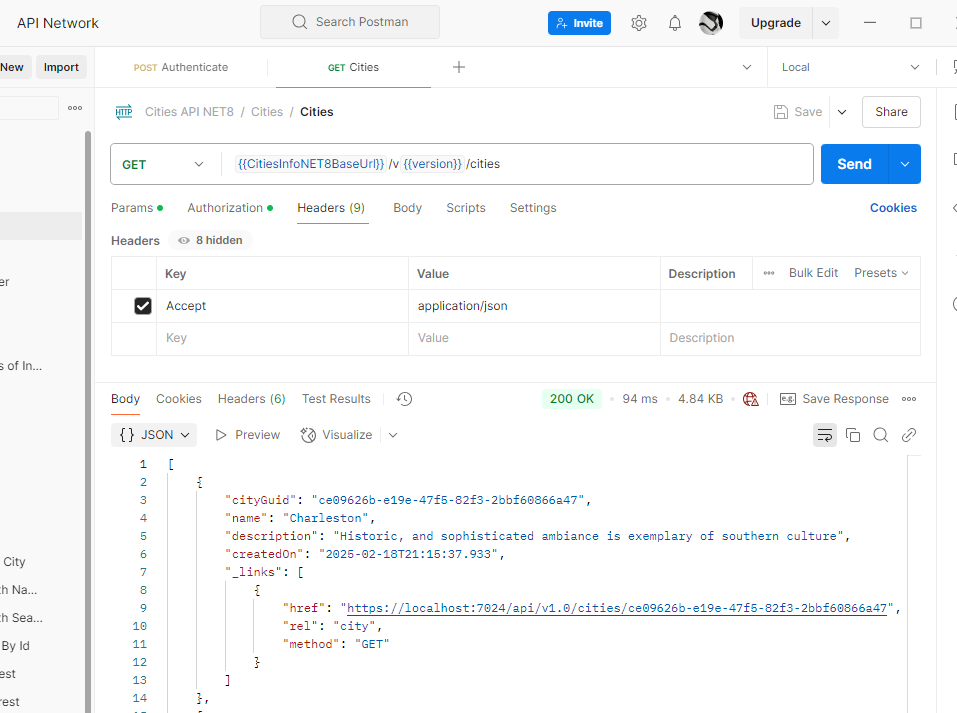
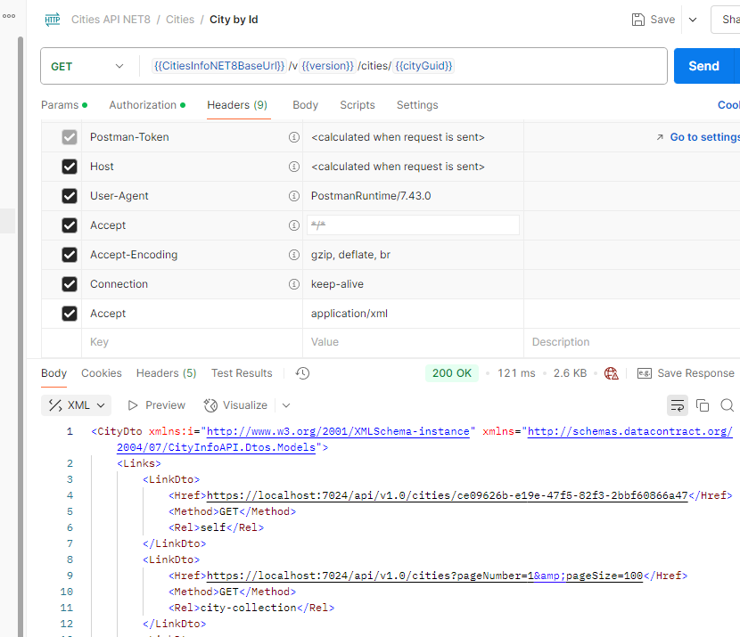
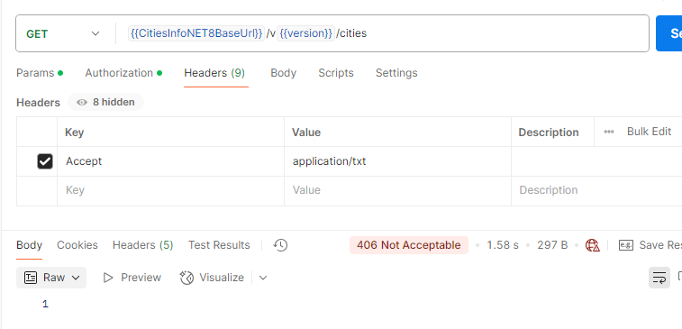
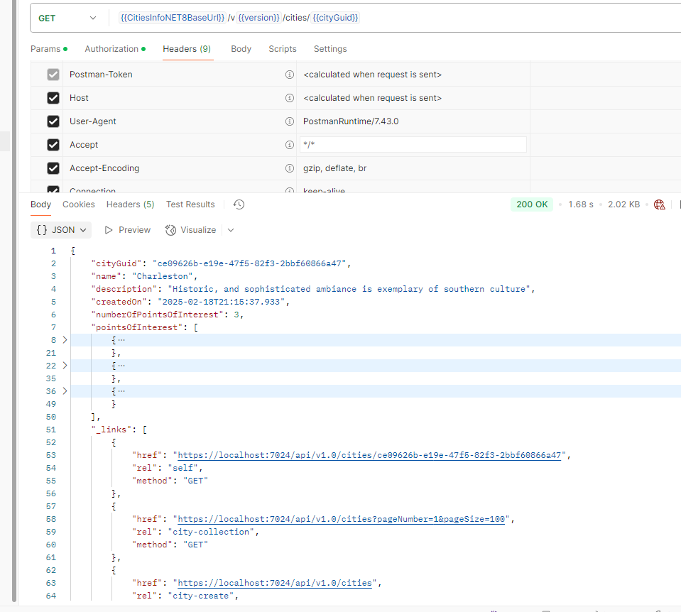

# City Info Demo API (.NET 8.0 version)
---
*Version 1.9.0*

## Summary
Welcome to the City Info Demo API - .NET 8 Version. Original version was in .NET 2.1 written in 2019. 

Imagine that you were developing a travel site and one of the requirements was you needed to be 
able to ask for a complete listing of cities; ask for any given city by it's ID and, if specifically asked for, 
you needed to be able to provide all the "touristy" things to do for that specified city 
(landmarks, parks, restaurants, and so on).  

This demo RESTful API does just that. It allows consumers to make request for USA Cities and their known "Points of Interest" (tourist attractions). It supports and demonstrates all HTTP verbs: GET, POST, PUT, PATCH, and DELETE.

API can be found at: 
- https://city-info-api-gvdwhraddbdyafgn.eastus-01.azurewebsites.net/  
- https://city-info-api-gvdwhraddbdyafgn.eastus-01.azurewebsites.net/swagger/index.html

API was built with knowledge from the following tutorials:
- https://app.pluralsight.com/ilx/video-courses/clips/7e1ef85b-2480-452d-ab67-1eb4e65fad1e
- https://app.pluralsight.com/ilx/video-courses/clips/849fef24-22a1-496f-9d8b-ebc4c146edc4


## Platform 
- ASP.NET 8  
- Entity Framework Core 8.0
- Swashbuckle / Swagger
- AutoMapper 12.0
- Serilog 8.0  
- Asp.Versioning.Mvc 8.1
- Microsoft.AspNetCore.Authentication.JwtBearer 8.0
- System.Linq.Dynamic.Core 

## To Do

### Known Issues

 - None at the moment.

### Enhancements
--- 
 
- Improve Sorting w/ Linq NuGet package.  See vid. Chapter 8. https://app.pluralsight.com/ilx/video-courses/1b57d9e1-fb13-4f6c-9a6d-850dc8e5a78f/3ee9a2b9-1f04-4b93-94cd-fa44860c7b56/fde36638-3499-4020-93fa-bceaea80a039 
- Add Custom Validation Annotations (like duplicate name check). 
- Allow for multiple Cities creation (endpoint).
- Allow for multiple Points of Interest creation (endpoint).
- use Azure KV for connection strings and other secrets.
- Use Docker.
- Add true user authentication / token assign.
- Build log table maintenance routine.
- Add Application Insights
- Learn how to add svc registrations as a method extension (see EmployeeManagement demo API and Authors & Courses API by Kevin Dockx)
- Factory Pattern / Svc.
- Add db connection to Health check and Uptime Robot.
- Unit Tests with CICD / Build Server / Azure.  https://app.pluralsight.com/ilx/video-courses/d1a07995-8bbd-4124-a48f-b1f7f672091e/cded68ee-4744-48a4-ab47-8f8c47c03158/47dd3c95-b1b2-460a-bb59-ee177cfca9f1
- ICollection vs IEnumerable vs IQueryable
- Expand on ProblemDetails implementation: https://app.pluralsight.com/ilx/video-courses/1b57d9e1-fb13-4f6c-9a6d-850dc8e5a78f/f618cfb7-a70d-4f26-9e67-0a7bdfe22dd4/ba1f72e2-558e-4c7d-9fa2-9bd607d19fab (download final product)
- Abstract classes: https://app.pluralsight.com/ilx/video-courses/clips/d5f818ac-9cec-4d19-a442-4123ea483ba3
Virtual vs abstract. Watch video.  https://app.pluralsight.com/ilx/video-courses/1b57d9e1-fb13-4f6c-9a6d-850dc8e5a78f/f618cfb7-a70d-4f26-9e67-0a7bdfe22dd4/f0a7d9c7-d3eb-4f22-ba57-05a962dd4f52  Also see orig City Info API
- Improve on pagination:  https://app.pluralsight.com/ilx/video-courses/1b57d9e1-fb13-4f6c-9a6d-850dc8e5a78f/a9261365-6296-41ce-ae0e-6b42958f77d0/b29f6bf8-36e5-4250-9912-dff3f1c5910c 
- [Produces("application/json", "application/xml")]

---

## Chapters
- [How To Test and Run Locally](#test)
- [Authentication](#authentication)
- [Endpoints](#endpoints)
- [Supported Media Types](#content)
- [Logging](#logging)
- [Architecture](#architecture)
- [Versions](#versions)
- [HATEOS](#hateos)
- [Swagger and Documentation](#swagger)
- [Releases](#releases)

<a href="" id="test" name="test"></a>
## How To Test and Run Locally
1) Download this source code. 

2) You will need to create an environment variable for the database connection string. You can create this in the local 'appSettings.Development.json' file or your local `launchSettings.json` file.  

Example: 

```json
"environmentVariables":
{
    "ASPNETCORE_ENVIRONMENT": "Development",
    "DbConnectionString": "Server={tcp:sql server},1433;Initial Catalog={db name};Persist Security Info=False;User ID={UID};Password={PWD};MultipleActiveResultSets=False;Encrypt=True;TrustServerCertificate=False;Connection Timeout=30;"
}
```

3) Download Postman. It can be downloaded here: [https://www.getpostman.com/](https://www.getpostman.com "https://www.getpostman.com").  In this repository, you will find a Postman Collection in the `Docs\Postman` folder.  The collection has most, if not all, test requests used by this API. It contains many GET, POST, PUT, PATCH, and DELETE requests. 

You can import this collection into your Postman application for ease of testing.  Or, you can simply manually call the endpoints below in your Postman application.


<a href="" id="authentication" name="authentication"></a>
## Authentication
A very basic implementation of JWT-based authentication is included with this API. 
Each API request and every endpoint requires a token in the header. The token will expire in **1 hour**. 

Requests for the token can be made here: `{{CitiesInfoNET8BaseUrl}}/v{{version}}/Authentication/Authenticate`.

It is a POST request and you will need to provide a proper UserName and Password. If authenticated, your token will be returned in the response.


You can then use this token in the header of your requests.  You can do this in Postman by adding a new header called `Authorization` and setting the value to `Bearer {your token}`.


OR 


<a href="" id="endpoints" name="endpoints"></a>
## Endpoints

### Cities

#### Get Cities 
`GET` `{{CitiesInfoNET8BaseUrl}}/v{{version}}/cities`  
This resource will return a collection of all Cities. It implements paging and other optional parameters.

**Optional Parameters**

| Parameter  | Default | Min Value | Max Value |
| ---------  |---------| --------- | ----------|
| includePointsOfInterest | true      | n/a         | n/a       |
| pageNumber | 1       | 1         | n/a       |
| pageSize   | 100      | 1         | 100        |
| search   | ""      | N/A         | N/A        |
| Name (filter)   | ""      | N/A         | N/A        |

**Examples**   
`{{CitiesInfoNET8BaseUrl}}/v{{version}}/cities?pageNumber=2&pageSize=10`

`{{CitiesInfoNET8BaseUrl}}/v{{version}}/cities?pageNumber=1&pageSize=100` (default values)

`{{CitiesInfoNET8BaseUrl}}/v{{version}}/cities?name=Richmond`

`{{CitiesInfoNET8BaseUrl}}/v{{version}}/cities?search=city`


**Custom Response Header:**   
The Response Header will provide the consumer helpful information in a custom item known as `X-CityParameters`.  It returns links to the next page (if applicable), previous page (if applicable), the name filter (if used), and total city count.    


#### Get City By Id  
`GET` `{{CitiesInfoNET8BaseUrl}}/v{{version}}/cities/{{cityGuid}}?includePointsOfInterest={{showPoints}}`   

Here, you can request a specific City and also provide an optional query string parameter to explicitly request the Points Of Interest along with the City data. If false, the points of interest collection will be intentionally empty (to lighten payload).  Otherwise, they will be included by default. 


#### Create a City
`POST` `{{CitiesInfoNET8BaseUrl}}/v{{version}}/cities`

You can `POST` (in the body) the `json` structure of a new city.

```json
{
	"name" : "Gotham",
	"description" : "Gotham city - sister city of Metropolis"
}
```

#### Update a City
`PUT` `{{CitiesInfoNET8BaseUrl}}/v{{version}}/cities`

You can `PUT` (in the body) the full `json` structure of a City for a full update. Due to the simplicity of the city object, it looks like a POST body but in theory, they could differ.

```json
{
	"name" : "Gotham",
	"description" : "Gotham city - sister city of Metropolis"
}
```
If successful, you will receive a `204 No Content` status code.

#### Patch a City
`PATCH`  `{{CitiesInfoNET8BaseUrl}}/v{{version}}/cities/{{cityGuid}}`  

Instead of updated the City whole resource, you can use a patch document and only update one or more properties of the resource such as passwords, emails, and so on. With this API, you can use a standard patch document 
and specify what part of the resource you want to update.

```json
[
	{
		"op": "replace",
		"path": "/name",
		"value": "updated name"
	},
	{
		"op": "replace",
		"path": "/description",
		"value": "updated description 2"
	}
]
```

If successful, it will return a `204 No Content` status code.

#### Delete a City
`DELETE`  `{{CitiesInfoNET8BaseUrl}}/v{{version}}/cities/{{cityGuid}}`  

Subjective. Arguably not a good idea and soft-deletes should be implemented instead. However, just for demonstration purposes, it is included.

If successful, it will return a `204 No Content` status code.


### Points Of Interest

#### Get Points of Interest  
`GET`  `{{CitiesInfoNET8BaseUrl}}/v{{version}}/pointsofinterest`

This resource will return a collection of all Points of Interest for all Cities. 
It also implements optional name and search parameters.

**Optional Parameters**

| Parameter  | Default | Min Value | Max Value |
| ---------  |---------| --------- | ----------|
| search   | ""      | N/A         | N/A        |
| Name (filter)   | ""      | N/A         | N/A        |

**Examples**   
`{CitiesInfoNET8BaseUrl}}/v{{version}}/pointsofinterest?search=the`

`{{CitiesInfoNET8BaseUrl}}/v{{version}}/pointsofinterest?name=Busch%20Gardens` 


#### Get Points of Interest for City  
`GET`  `{{CitiesInfoNET8BaseUrl}}/v{{version}}/cities/{{cityGuid}}/pointsofinterest`  

You can request to see a collection of the Points of Interest for any given 
City by CityGuid ("id").

#### Get Point of Interest By Id  
`GET`  `{{CitiesInfoNET8BaseUrl}}/v{{version}}/cities/{{cityGuid}}/pointsofinterest/{{pointGuid}}`

At this endpoint, you can request a specific Point of Interest for a specific City assuming you know the Ids of both resources. 


#### Create a Point of Interest  
`POST`  `{{CitiesInfoNET8BaseUrl}}/v{{version}}/cities/{{cityGuid}}/pointsofinterest`
You will need to provide a name and a description as JSON data in the body of the POST.  

```json
{
	"name": "Gino's Famous Pizza",
	"description": "Known all over the world for it's famous NY style pizza"
}
```

 If your post is successful, it will return a `201 Created Status` with the new Point of Interest.  Furthermore, it will return the location of this new resource in the Header of the response.


#### Update a Point of Interest
`PUT`  `{{CitiesInfoNET8BaseUrl}}/v{{version}}/cities/{{cityGuid}}/pointsofinterest/{{pointGuid}}`

This the endpoint where you can update an entire Point of Interest resource. You do this 
through a PUT and provide the whole Point of Interest with it's new values.

Due to the simplicity of the Point of Interest object, it looks like a POST body but in theory, they could differ.

```json
{
    "name": "POI Test 3 updated!",
    "description": "POI Test 3 updated!"
}
```
If successful, you will receive a `204 No Content` status code.


#### Patch a Point of Interest
`PATCH`  `{{CitiesInfoNET8BaseUrl}}/v{{version}}/cities/{{cityGuid}}/pointsofinterest/{{pointGuid}}`

Instead of updated the whole resource, you can use a patch document and only update one or more properties of the resource such as passwords, emails, and so on. With this API, you can use a standard patch document and specify what part of the resource you want to update.

```json
[
	{
		"op": "replace",
		"path": "/description",
		"value": "Rico's world famous restaurant."
	}
]
```

If successful, it will return a `204 No Content` status code.

#### Delete a Point of Interest
`DELETE`  `{{CitiesInfoNET8BaseUrl}}/v{{version}}/cities/{{cityGuid}}/pointsofinterest/{{pointGuid}}`

Again, this is subjective. Arguably not a good idea and soft-deletes should be implemented. However, just for demonstration purposes, it is included.

If successful, it will return a `204 No Content` status code.


<a href="" id="content" name="content"></a>
## Support Media Types 

This demo API will return either JSON data or Xml Data (via content negotiation) depending on the Accept parameter you provide in your request header. JSON is the default if nothing is provided or an invalid type is provided in the request.  

**JSON**  
  

**Xml**  


If you provide an **unsupported** media type in the request, it will, by design, give you a `406 Not Acceptable` response.  


Furthermore, it will also accept `Xml` and the Content-Type if specified. You can if needed, `POST` data with `Xml` instead of `JSON`.   


<a href="" id="logging" name="logging"></a>
## Logging 
This API uses Serilog ([https://serilog.net/](https://serilog.net/ "https://serilog.net/")) 
for logging.  It is currently set up to log to local text files, to the console, and to the Sql Database `Logs` table.


<a href="" id="architecture" name="architecture"></a>
## Architecture  
This API is designed with what I consider to be, a sound and proper architectural design.  It has multiple layers (projects) and each layer has a single responsibility. 

**Data Layer**  
This is the most protected layer.  Nothing interacts with this layer other than the Logic layer. This data is never exposed to the client/consumer site via Controllers.  This layer contains all of the Entity Framework plumbing, classes defining all of the Entities, and data Repositories - where **all** the data persistence resides.


**DTO Layer**   
This layer contains all of the DTOs for this app.  These DTOs represent data that is either returned by the API or received by the consumer of the API.  Data from the data layer is never directly returned or received.  The Logic layer of this app will call the appropriate Repository and map the results to correct DTO so it can be returned to the consumer or processed by the logic layer.

Every form of data interaction (read, write) is represented by a DTO in this layer.


**Service Layer**  
This is the business layer.  All requests from the Controllers go through this layer. Controllers do not directly interact with the Repositories from the Data Layer. This is where any and all business logic with reside in addition to all data mapping.

1. Request from Controller 
1. goes through a Service 
1. Processor calls Repository 
1. maps entity data to DTO 
1. returns results to Controller

**Web Layer**  
This is the layer exposed to the public. This layer contains all the typical Controllers and app configuration.

 

<a href="" id="versions" name="versions"></a>
## Versions
This API supports versioning. All of the standard endpoints and resources are exposed for a hypothetical public-facing API: getting cities, getting a specific city, getting a city's points of interest, updating a point of interest, and so on. These all fall under Version 1.0 of this API.  

Is is possible (although not needed) that we could develop and include new resources and endpoints to fall under a "2.0" version that only 2.0 consumers could use.


<a href="" id="hateos" name="hateos"></a>
## HATEOS

Adhering to the HATEOS principles of good RESTful design, all `GET` requests include media **navigational links** in the response to inform the user on how else they can consume the requested resource.


  

<a href="" id="swagger" name="swagger"></a>
## Swagger and Documentation

This API is fully documented under the OpenAPI 3 standards (https://www.openapis.org/).  It is uses Swashbuckle which includes the Swagger/API Explorer, Swagger UI, and Swagger CodeGen SDKs.


The Controllers and types in which they return are fully documented and notated per Open API 3 standards.  Doing this allow the API Explorer to "explore" this application and create specification documents ("swagger docs").

You can see all of this documentation via the Swagger UI interface.

**Local**  
[https://localhost:7024/swagger/index.html](https://localhost:7024/swagger/index.html)


**Production**  
https://city-info-api-gvdwhraddbdyafgn.eastus-01.azurewebsites.net/swagger/index.html


<a href="" id="releases" name="releases"></a>
## Releases

| Version	| Date			| Details	|
|---------	|---------		|---------	|
| 1.0.0		| 03.14.2025	| Initial Release |
| 1.1.0		| 03.26.2025	|Added xUnit Unit Tests | 
| 1.2.0		| 04.11.2024	|Updated CreateCity action to allow Points of Interest to be created with a createCity request. | 
|			|				|Put limit on Points of Interest per City to 20.  Will not allow more than 20 Points of Interest to be created per city.|
| 1.3.0		| 04.25.2025	|Added example of [HttpOptions] on Cities endpoint.	| 
|			|				|Added example of [HttpHead] attribute. Would be useful in pagination requests. Wanting header data back but not the body.|
|			|				|Updated Postman collection.|
|			|				|Added [ProducesDefaultResponseType] attributes to Controller actions.|
| 1.4.0		| 05.16.2025 	|Added parent object (City) to child objects (Points of Interest).|
| 1.5.0		| 05.21.2025	|Added States resource. Each city is related to a State.| 
| 1.6.0		| 06.03.2025	|Removed need for CityWithoutPointsOfInterestDto. Not needed.| 
|			|				|Implemented global use of CityRequestParameters obj.|
|			|				|Implemented CountCities resource.|
|			|				|Better organized Models and Dtos.|
|			|				|Added db connectivity test to health check.|
| 1.7.0		| 06.13.2025	|Implemented Property Mapping Processor which allows for for sorting on any property on the City.| 
| 1.8.0 | 07.07.2025 | For demonstration purposes and as an exercise, added caching to the States endpoint. |
| 1.9.0 | 07.09.2025 | Added root controller with HATEOS links. |
|  |  | Renamed CityRepository class for consistency. |
|  |  | Made "version" configurable. |
